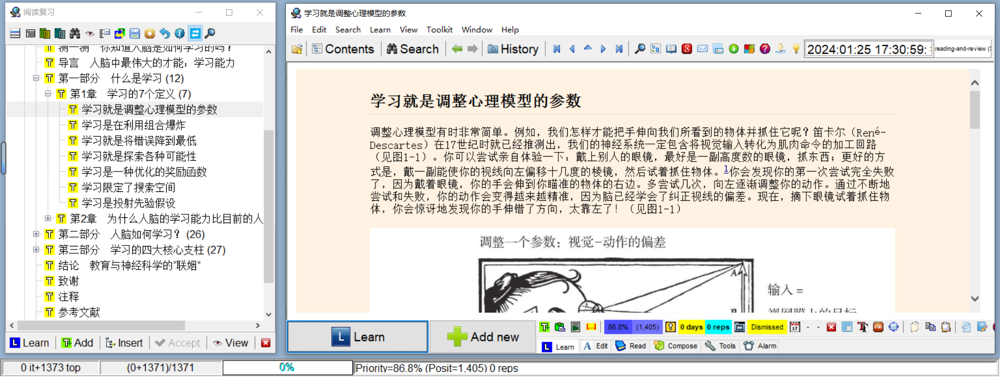
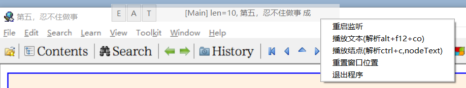

# supermemo-toolkit(smtk)

SuperMemo 增强工具(CLI 命令行)。包含图链整理、EPUB 图书转换导入、Latex 公式转图片、sm2anki、修补导出标题乱码、AutoTTS 卡片朗读等。

## 1. Install

### 1.1 安装&更新：

1. 下载`smtk.exe`（v0.1.28）交互式终端程序。使用方式：双击打开`smtk.exe`。
   1. 更新：下载新版EXE替换旧版EXE。
2. 配置 smtk：
   1. 设置 sm 程序所在路径，软件需要查找和读取 sm 自动存储的 systems 集合
      1. 用法：`smtk config set program 'sm.exe所在路径'`
      2. 例子：`smtk config set program 'D:\SuperMemo'`，比如我的`sm.exe`在`D:\SuperMemo`路径下。
3. 然后就可以正常使用了，请继续阅读下列功能使用说明。

### 1.2 遇到的问题

支持的supermemo版本？SuperMemo 15.5 到 SuperMemo最新版，几乎所有功能应该没有版本限制。仅autotts功能有版本功能限制：暂时不支持WV组件。

遇到的问题 2：supermemo 只支持五种图片格式："image/jpeg"、"image/jpg"、"image/png"、"image/gif"、"image/bmp"，PathPix 功能只支持网络图片转换为受支持的五类图片，本地暂时不支持。E2SM 功能只对书籍图片进行复制，暂时不支持图片转换为受支持的五类图片格式。

### 1.3 其他安装方式

`uv tool`、`pipx`：“Python（Android） 系统”下的 whl（apk） 格式软件包在线“安装管理器”。安装应用请务必联网。

- uv：自己就能自动全部搞定
  - 安装：`uv tool install --compile supermemo_toolkit-py3-none-any.whl`
  - 更新：`uv tool install --compile --reinstall save-path/your-app.whl`
- pipx：需要手动安装python。
  - 安装：`pipx install supermemo_toolkit-py3-none-any.whl`
  - 更新：`pipx install --force save-path/your-app.whl`
- 用法：安装whl包，打开终端执行命令
  - 打开 CMD 或者 PowerShell，输入命令：`smtk`。
  - shift+鼠标右键->在此处打开 PowerShell 窗口。
  - 使用`Win + R`启动运行窗口直接输入 smtk 相关命令

## 2. PathPix

> supermemo 图链整理工具。

PathPix：任意类型的网络图片整理为受支持的五种格式的图片，并网络和本地图片收集起来转换为相对路径，存放在 elements 文件夹中。其中，网页内嵌图片由 pathpix 管理，元素注册表图片由图片注册表管理。pathpix 管理的图片文件，可以导入图片注册表中。

详细问题请查看：旧版 Pathpix 文档：https://docs.qq.com/doc/DQnRpb0VNUEVvR3dl

致谢：● 兰迥 ●Merlin ● 水流众生 ●st ●aicling

### 2.1 整理图片

1. 配置 SuperMemo 路径
   1. `smtk config set program “SM软件路径”`
   2. 路径范例：`C:\Users\Snowy\Desktop\sm18`，注意是 sm18.exe 程序的根路径，就是 sm18.exe 所在的目录。不要这样写：`C:\Users\Snowy\Desktop\sm18\sm18.exe`
2. 使用`smtk clist`列出集合。若未列出集合一般是软件路径未设置正确、或者没有使用 SuperMemo 默认存放集合的 System 路径位置。
3. 使用`smtk pathpix <集合名字>`整理集合图片
   1. 比如`smtk pathpix "ALL IN ONE" ` 就可以让程序按照策略进行整理了。
   2. 也可以使用`smtk pathpix --least-col`整理最后一次使用的集合。

### pathpix与图像注册表
导入图像注册表的图片都会分配一个slot，拷贝后和元素们放一起。称之为图片元素吧。所以图像注册表中的图片，是一个独立的图片集合，拥有独立的图片数据和索引。

pathpix处理的网络和本地图片都会放在两个文件夹里面web_pic、local_pic，清理的话也只会清理这两个文件夹里面的图。这样图像注册表和pathpix管理图片互不干扰。

pathpix管理的图片文件，可以导入图像注册表中。由图像注册表管理。

### 常见问答QA
问：图片组件使用的会删除吗？
答：图片注册表和pathpix管理的图片，相互独立，互不干扰。图片组件一般都是用的图像注册表。所以不会。但如果你直接在图片组件中引用pathpix两个文件夹中的图片，如若没有任何HTML卡片引用，也会被清理。

问：那我先前使用ctrl+f8 本地化的图片呢？
答：也不会。ctrl+f8 本地化的图片，不会放到web_pic这两个文件夹，所以没有影响。pathpix只整理web_pic、local_pic这里面的图片

问：如何使用pathpix的图片清理功能？
答：smtk pathpix "集合名" --clean

问：清理的图片去了哪里？
答：systems/集合/temp/unused_im文件夹。你需要手动删除该文件夹。pathpix不会主动删除它们。

问：软件付费嘛？
答：软件源码开放在github。只是自己使用，分享纯粹是为爱发电，发扬开源精神。如果你请我喝一杯，朋友，你真的太慷慨了，很感激！Best wishes！

## 3. E2SM

1. 从 epub 图书生成 xml 格式的 sm-book 图书。
2. 预处理epub，转换为纯ASCII字符集。`smtk e2sm --prep <epub_file> <out_folder>`

生成的图书会包含 XML 格式图书 和 书籍图片文件夹 两个内容。需要生成的**书籍图片文件夹**放到 SM 集合的`your_collection/elements/local_pic`文件夹下，如果你不需要的图片显示的话，可以不用放。一般情况下集合默认全路径为：`Root_SuperMemo/systems/your_collection`。

通过目录项自动补全及链接与目标文件的一致性校验，并结合锚点的合理分割以避免信息遗失，实现内容完整性的双重保障。

### 3.1 使用方法

例如我想将“如何阅读一本书.epub”文件转换为可导入的 supermemo 集合文件（XML+图片附件文件夹）

1. 执行转换命令：按顺序生成 `smtk e2sm --seq <epub_file> <out_folder>` （这个命令的含义是图书按照前后顺序转换为一系列 Topic 列表）
   - 使用比较简单，对于 win10 及以上版本的系统，可以在桌面-右单击-使用终端打开
   - 在终端中输入`smtk e2sm --seq 如何阅读一本书.epub C:\Users\Name\Desktop`
   - 按 Enter 键执行此命令，稍后会在桌面生成一个 XML 文件和对应的书籍图片文件夹。
2. 把“书籍图片文件夹”放到对应的位置
   - 文件夹需要放置到上文说的指定的位置
   - 因为程序在处理过程会自动将绝对路径转换为固定的相对路径，这个路径在转换后的 XML 文件中是写好的。
3. 导入生成的 XML 图书到 SuperMemo
   - 打开 supermome 软件，点击菜单按钮：File - Import - XML
   - 在打开的对话框中选择转换好的电纸书 XML 集合文件，点击导入。
   - 导入成功的同时就可以看到最终的效果了。

### 3.2 更多的转换方式

- 按目录生成 `smtk e2sm --toc <epub_file> <out_folder>`
  - 需要图书有良好的目录，若没有，需使用 calibre 生成并整理目录
- 按顺序生成 `smtk e2sm --seq <epub_file> <out_folder>`
  - 有书即可，不按照 EPUB 目录文件生成，而是按照 EPUB 图书内文档文件的线性顺序生成，比较适合 PDF 版 epub，效果查看文件：./docs/Snipaste_2024-03-24_09-17-23.png
- 按单个 Topic 生成 `smtk e2sm --topic <epub_file> <out_folder>`
  - 有书即可，EPUB 转换为一个 SuperMemo Topic，一本书即是一篇文章，配合 SuperMemo 阅读点使用更佳。
- 按单个 Topic 生成，按长度分片并插入 HR 标签 `smtk e2sm --topic --limit 1500 <epub_file> <out_folder>`
  - 在单个 TopicEpub 中按照限制字数（例如 1500 字）在段后插入 hr 标签
  - 使用 SuperMemo 的 split article 进行分割得到图书分片。
- 预处理epub：`smtk e2sm --prep <epub_file> <out_folder>`，转换为纯ASCII字符集（可选）用于修复SM20导入中文epub功能乱码。

## 4. latex2img

- latex 公式转图片。
  - 用法：`smtk imtex <formula_text> <outpath>`
  - 例子：`smtk imtex "$\sum_{i=0}^\infty x_i$" ./a.png`
  - 说明：将数学公式`$\sum_{i=0}^\infty x_i$`保存到`./a.png`

## 5. sm2anki

打开 supermemo，选择要导出的分支::右单击::`导出（Export）`::`Q&A text file`，然后弹出一个选择对话框，默认即可，随便选择。

- 第二个选项 Allow HTML 选项是导出 HTML 片段，到 ANKI 中可以有挖空的高亮效果。
- 第二个选项不用管。用于筛选的。
- 第三个选项是导出 Title 标题，用不着。
- 第四个选项是包含 Element ID，这个 ID 可以使用 Ctrl + G 输入 ID 后跳转的元素。

需要打开 Anki，并且安装 ankiconnect 插件。

- 使用方式：`smtk sm2anki <qafile> [--deckname "your_deskName"]`
  - 使用默认牌组 `smtk sm2anki "docs/TEQA.htm"`
    - 默认牌组是 SuperMemo Cards，默认的模版是 问答题（SuperMemo），包含字段：Title、Element、Question、Answer。
  - 使用自定义牌组 `smtk sm2anki "docs/TEQA.htm" --deckname  "your_deskName"`
    - 自定义牌组 your_deskName

## 6. comptitle

修补导出`Source code`或者`XML`文件标题乱码或缺失。

1. 选定需要导出的分支
2. 导出选定分支的知识树 HTM-TOC 文件。
   1. 使用 `知识树右键菜单>>Export>>Document>>Document export options:Knowledge tree in a single file`
3. 导出 Source code 或者 XML 文件。
   1. 使用 `知识树右键菜单>>Export>>Source code`
   2. 使用 `知识树右键菜单>>Export>>XML`
4. 使用 HTM-TOC 修补导出的 Source code 或者 XML 文件。
   1. `smtk comptitle <htmtocfile> --node <nodefile>`
      1. 为避免`Source code`乱码，程序采用下划线代替空格并包裹数字
   2. `smtk comptitle <htmtocfile> --xml <xmlfile>`

## 7. autoTTS

AutoTTS 卡片朗读 文本转语音

功能列表：翻页自动播放（启动监听 LE、停止监听 LE、重启监听）、停止播放 RE、重复播放 A、复制播放、解析播放

1. 如何使用
   1. 首先必须打开 supermemo 软件，否则 autotts 结束运行。
   2. 第二步执行`smtk autotts`。
   3. 启动后会在屏幕上中部，显示软件悬浮条。
   4. **左键**点击`E`按钮开始监听卡片翻页，翻页自动切换
      1. **右键**点击`E`按钮停止当前播放。
         1. 这时候可以手动复制需要播放内容并使用`T`按钮播放
         2. 或者使用`A`按钮再次播放一次。
2. 功能介绍
   1. `E`：左键是开始/停止监听，右键是停止播放的意思
   2. `A`：重播当前卡片
   3. `T`：播放复制的文本，从最近一次剪贴板中读取文本然后播放
   4. 悬浮条可以拖动。
   5. 右键悬浮条任意位置**弹出菜单**
      1. 重启监听
      2. 播放文本(解析 alt+f12+co 快捷键序列获得文本)
      3. 播放结点(解析 ctrl+c 快捷键序列获得 nodeText 文本)
      4. 重置窗口位置
      5. 退出程序
   6. 配置自定义语音模型、语速、和音量
      1. `smtk config list --recommend`，列出推荐的中文模型，或者所有可用模型`smtk config list --voices`
      2. `smtk config set voice en-US-BrianMultilingualNeural`，默认模型：en-US-BrianMultilingualNeural
      3. `smtk config set rate +0%`，默认 rate：+0%
      4. `smtk config set volume +0%`，默认 volume：+0%
   7. 仅使用拷贝发音模式
      1. 不用打开 supermemo，使用`Win + R`执行`smtk autotts --onlyat`
      2. 软件会禁用关于 supermemo 的功能。只保留基本的 A 按钮和 T 按钮的功能。
3. 注意事项和常见问题解决
   1. 监听的逻辑是鼠标必须在 SuperMemo 的内容主窗口的矩形区域。
   2. 翻页自动播放的逻辑是，当窗口聚焦的时候获取窗口标题，对比上一次和本次标题，若不一样则进行播放。
   3. 播放时会在悬浮窗显示当前播放的文本长度和前十个字符。
   4. 如果发现悬浮窗的预览的文本发生改变或出现，但没有播放，可以使用 A 按钮重试，重试不行可以检查控制台是否打印 Timout 超时字样，如果打印则是网络环境的问题，可以更换模型或者禁用或修改 VPN 等手段解决。
   5. 如果发现播放速度延迟大于 3 秒，一般为网络环境问题，可以根据需要取舍等待，或者请根据第 4 条提供方案解决。
   6. 如果程序控制台报错，且翻页自动播放失效。可以尝试右键悬浮条-菜单-重启监听解决。

## LICENSE

本软件遵守开源协议，协议类型为：GPLv2。

## Star History

## A cup of coffee

见证阅读量飙升的喜悦，点亮更多孤独求索者的学习之路，让每一份坚持都收获更温暖的回报。

致谢：NEXT，郁蒸十四，但为君故-sm18tb8
