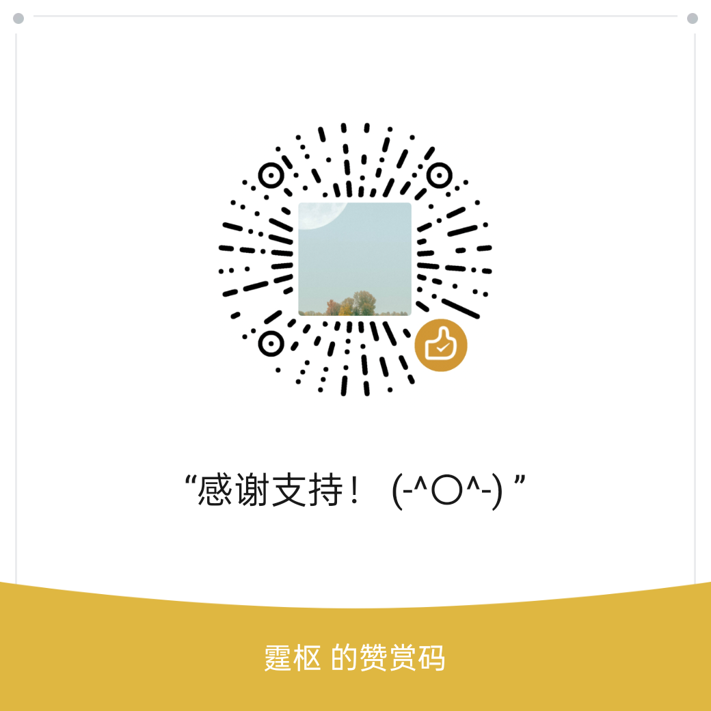

# supermemo-toolkit(smtk)

SuperMemo 增强工具（CLI 命令行）。包含图链整理、EPUB 图书转换导入、Latex 公式转图片等。

## 1. Install

pipx：“python 系统”下的 whl 格式软件包安装管理器。pipx 安装应用请务必联网。

推荐的安装方式是 pipx，pipx 可以理解为 Android 系统的应用程序管理器，而 whl 类比为安卓的 apk 应用。pipx 就是用来安装和管理 whl 格式的 python 软件包。其次，你可以下载源代码的方式，本地构建一个软件开发环境运行，这样做的任务复杂度带来的试错成本略高，需要安装 py、poetry，然后使用 poetry 安装依赖，配置好后才可以开始使用。

### 1.1 安装步骤：

1. 安装 Python 最新版，目前版本是 3.13.2
2. 安装 pipx 应用安装管理器：
   1. `python3 -m pip install --user pipx`
   2. `python3 -m pipx ensurepath`
3. 下载`supermemo_toolkit-py3-none-any.whl`
4. 执行`pipx install supermemo_toolkit-py3-none-any.whl`等待安装成功。
5. 安装成功后，可以执行`smtk`命令验证是否安装成功。

### 1.2 遇到的问题

遇到的问题 1：若出现 ERROR: No matching distribution found for XXX，一般是网络问题，切换 PYPI 源即可，可以使用下列方式切换 PYPI 源。

```bash
# 切换阿里源
pip config set global.index-url http://mirrors.aliyun.com/pypi/simple/
pip config set install.trusted-host mirrors.aliyun.com
# 换回默认源
pip config unset global.index-url
```

遇到的问题 2：执行`python3 -m pip`报错：No module named 'pip'，可以通过下列方式解决。

```bash
python -m ensurepip

python -m pip install --upgrade pip
```

### 1.3 关于更新：

同样使用 pipx 应用安装管理器，执行`pipx install save-path/your-app.whl --force`显示成功后即可更新成功。

## 2. PathPix

> supermemo 图链整理工具。

PathPix：任意类型的网络图片整理为受支持的五种格式的图片，并网络和本地图片收集起来转换为相对路径，存放在 elements 文件夹中。其中，网页内嵌图片由 pathpix 管理，元素注册表图片由图片注册表管理。pathpix 管理的图片文件，可以导入图片注册表中。

详细问题请查看：旧版 Pathpix 文档：https://docs.qq.com/doc/DQnRpb0VNUEVvR3dl

致谢：● 兰迥 ●Merlin ● 水流众生 ●st ●aicling

### 2.1 整理图片

1. 打开终端
   1. WIN R 打开 CMD 或者 PowerShell，输入命令：`smtk`。
   2. 或者 shift+鼠标右键->在此处打开 PowerShell 窗口。
2. 设置 SuperMemo 路径
   1. `smtk config set program “SM软件路径”`
   2. 路径范例：`C:\\Users\\Snowy\\Desktop\\sm18`，注意是 sm18.exe 程序的根路径，就是 sm18.exe 所在的目录。不要这样写：`C:\\Users\\Snowy\\Desktop\\sm18\\sm18.exe`
3. 使用`smtk clist`列出集合。若未列出集合一般是软件路径未设置正确、或者没有使用 SuperMemo 默认存放集合的 System 路径位置。
4. 使用`smtk pathpix <集合名字>`整理集合图片
   1. 比如`smtk pathpix "ALL IN ONE" ` 就可以让程序按照策略进行整理了。
   2. 也可以使用`smtk pathpix --least-col`整理最后一次使用的集合。

## 3. E2SM


从 epub 图书生成 xml 格式的 sm-book 图书。

生成的图书会包含 XML 格式图书 和 书籍图片文件夹 两个内容。需要生成的**书籍图片文件夹**放到 SM 集合的`your_collection/elements/local_pic`文件夹下，如果你不需要的图片显示的话，可以不用放。一般情况下集合默认全路径为：`Root_SuperMemo/systems/your_collection`。

### 3.1 使用方法

例如我想将“如何阅读一本书.epub”文件转换为可导入的 supermemo 集合文件（XML+图片附件文件夹）

1. 执行转换命令
   - 使用比较简单，对于 win10 及以上版本的系统，可以在桌面-右单击-使用终端打开，在终端中输入`smtk e2sm --linear 如何阅读一本书.epub C:\Users\Name\Desktop`按 Enter 键执行此命令（这个命令的含义是图书按照前后顺序转换为一系列 Topic 列表），稍后会在桌面生成一个 XML 文件和对应的书籍图片文件夹。
2. 把“书籍图片文件夹”放到对应的位置，
   - 文件夹需要放置到上文说的指定的位置，因为程序在处理过程会自动将绝对路径转换为固定的相对路径，这个路径在转换后的 XML 文件中是写好的。
3. 导入生成的 XML 图书到 SuperMemo
   - 打开 supermome 软件，点击菜单按钮：File - Import - XML，在打开的对话框中选择转换好的电纸书 XML 集合文件，点击导入。导入成功的同时就可以看到最终的效果了。

### 3.2 更多的转换方式

按目录生成、按顺序生成、按单个 Topic 生成。

```bash
smtk e2sm --toc epub_file out_folder  #（需要图书有良好的目录，没有需使用calibre生成并整理目录）
smtk e2sm --linear epub_file out_folder  #（有书即可，不按照EPUB目录文件生成，而是按照EPUB图书内文档文件的线性顺序生成，比较适合PDF版epub，效果查看文件：./docs/Snipaste_2024-03-24_09-17-23.png）
smtk e2sm --topic epub_file out_folder  #（有书即可，EPUB转换为一个SuperMemo Topic，一本书即是一篇文章，配合SuperMemo阅读点使用更佳。）
```

## 4. latex2img

latex 公式转图片。

```bash
smtk imtex <formula_text> <outpath>
smtk imtex "$\sum_{i=0}^\infty x_i$" ./a.png
```

## 5. sm2anki

打开 supermemo，选择要导出的分支::右单击::`导出（Export）`::`Q&A text file`，然后弹出一个选择对话框，默认即可，随便选择。

- 第二个选项 Allow HTML 选项是导出 HTML 片段，到 ANKI 中可以有挖空的高亮效果。
- 第二个选项不用管。用于筛选的。
- 第三个选项是导出 Title 标题，用不着。
- 第四个选项是包含 Element ID，这个 ID 可以使用 Ctrl + G 输入 ID 后跳转的元素。

需要打开Anki，并且安装ankiconnect插件。

```bash
# 使用方式：
smtk sm2anki <qafile>
# 默认牌组是TEQA Cards，默认的模版是TEQA问答题，Title、Element、Question、Answer。
smtk sm2anki "docs/TEQA.htm"
# 自定义牌组your_deskName
smtk sm2anki "docs/TEQA.htm" --deckname  "your_deskName"
```

## LICENSE

本软件遵守开源协议，协议类型为：GPLv2。

## Star History

[](https://star-history.com/#Zacharia2/SuperMemo-Toolkit&Date)

## 赞助

喜欢这个工具嘛，感谢您的支持！


